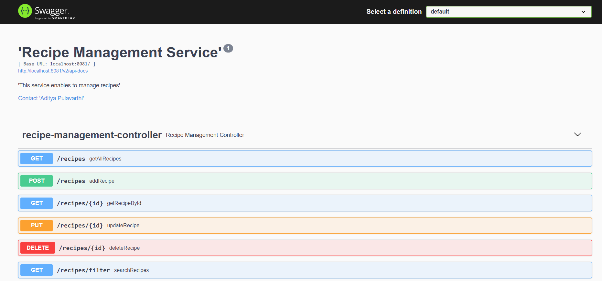

# Recipe Management API

The Recipe Management API is a Java application that allows users to manage favorite recipes. It provides RESTful endpoints for adding, updating, removing, and fetching recipes. Additionally, users can filter available recipes based on various criteria.

## Table of Contents

- [Features](#features)
- [Endpoints](#endpoints)
- [Technologies Used](#technologies-used)
- [Getting Started](#getting-started)
- [Usage](#usage)
- [Swagger Documentation](#swagger-documentation)

## Features

The Recipe Management API provides the following features:

1. Add a new recipe.
2. Update an existing recipe.
3. Remove a recipe.
4. Fetch a recipe by ID.
5. Fetch all recipes.
6. Filter recipes based on the following criteria:
    - Whether or not the dish is vegetarian.
    - The number of servings.
    - Specific ingredients (either include or exclude).
    - Text search within the instructions.

## Endpoints

The following are the available endpoints:

- `GET /recipes`: Fetch all recipes.
- `GET /recipes/{id}`: Fetch a recipe by ID.
- `POST /recipes`: Add a new recipe.
- `PUT /recipes/{id}`: Update an existing recipe.
- `DELETE /recipes/{id}`: Remove a recipe.
- `GET /recipes/filter`: Filter recipes based on criteria (query parameters).

## Technologies Used

The Recipe Management API is built using the following technologies:

- Java
- Spring Boot
- Spring Data JPA
- H2 Database
- Maven

## Getting Started

To run the Recipe Management API on your local machine, follow these steps:

1. Clone the repository: `git clone https://github.com/adityapnv/recipe-management-service.git`
2. Navigate to the project directory: `cd recipe-management`
3. Build the application: `mvn clean install`
4. Run the application: `mvn spring-boot:run`

The API will start running at `http://localhost:8081`.

## Usage

Once the application is up and running, you can use tools like `curl`, `Postman`, or any REST client to interact with the API.

To test the endpoints, refer to the [Endpoints](#endpoints) section for the available API endpoints and their descriptions.

## Swagger Documentation

The API documentation is available using Swagger. You can access the Swagger UI to explore the API endpoints and interact with them directly.

To access the Swagger documentation, open your web browser and navigate to: http://localhost:8081/swagger-ui/#/recipe-management-controller

The Swagger UI provides a user-friendly interface to interact with the API, test endpoints, and view request and response details.

